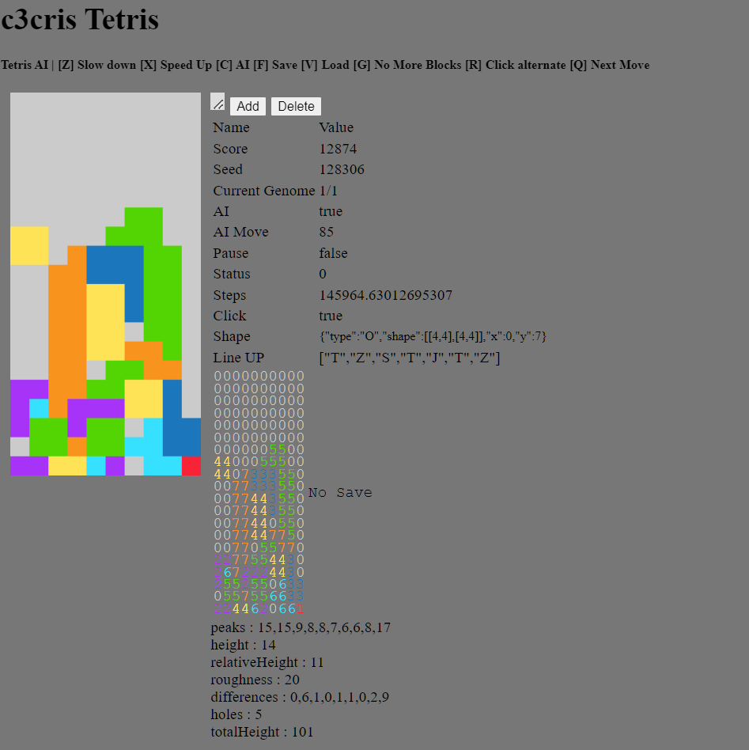

# c3tetris
#### by Cris Ghiurea

## Demo
[https://c3cris.github.io/c3tetris/](https://c3cris.github.io/c3tetris/)

c3tetris is a proof of concept of a NeuroEvolution of Augmenting Topologies Tetris AI.


### Screenshot


### Sensors (inputs)
$let\ c = [list\ of\ column\ height]$

$let\ k = length(c)$

Peaks : $$c_{n}$$

Height : $$Max(c_{n})$$

Relative Height : $$Max(c_{n}) - Min(c_{n})$$

Roughness : $$\sum_{n=1}^{k} \left ( \left | c_{n}-c_{n+1}  \right | \right )$$

Differences : $$x = c_{n}-c_{n+1}$$

Holes : 
$$\sum_{n=1}^{k}  \sum_{r=1}^{c_{n}} \left ( \epsilon(c_{n_{r}}) \right ) $$

$$ \epsilon (x)  = \begin{cases} 1 & \textrm{if } x = 0 \\
0 & \textrm{if } x \neq 0 \end{cases}$$

Total Height : $$\sum_{n=1}^{k} \left (   c_{n}    \right )$$


### Example Evolution Weights 
```
 {
    "id": 1,
    "rowsCleared": 25.6993,
    "weightedHeight": -0.3427,
    "cumulativeHeight": 0.3588,
    "relativeHeight": -0.5155,
    "holes": -12.9232,
    "roughness": -1.7214
  }
```


#### Shapes
```
[id] Shape

[1] I:  █ █ █ █

[2] J:  █
        █ █ █

[3] L:      █
        █ █ █
   
[4] O:  █ █
        █ █
   
[5] S:    █ █  
        █ █
   
[6] T:  █ █ █
          █

[7] Z:  █ █
          █ █
    
```
#### Example board
```
0000000000
0000000000
0000000000
0000000000
0000000000
0000000000
0000005500
0000055500
0007333550
4477333550
4477443550
0077443550
0077440550
0077447750
0077055770
2277554430
2672224430
2552550633
0557556633
2244620661
```
